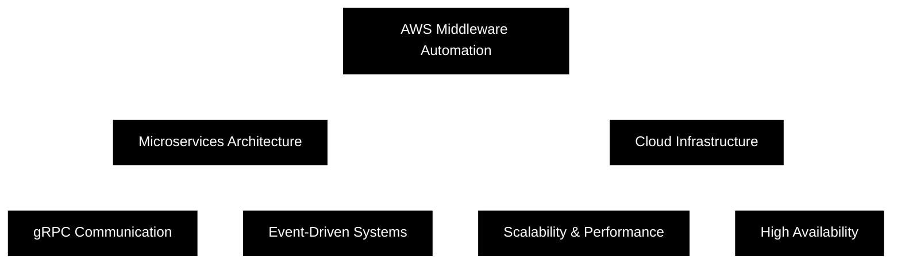

<div align="center">
  
# **SOURAV RAJVI**

### Backend Developer | Cloud Architect | Microservices Expert


---


[](https://linkedin.com/in/souravrajvi)
[](https://souravportfoliov1.netlify.app/)
[](mailto:souravrajvi@gmail.com)

</div>

---

## **ABOUT**

```typescript
const developer = {
    name: "Sourav Rajvi",
    role: "Backend Developer",
    location: "India",
    currentProject: "AWS Middleware Automation System",
    
    expertise: {
        backend: ["Node.js", "Go", "Java", "Python"],
        frontend: ["React", "Next.js", "Vue.js", "Svelte"],
        databases: ["PostgreSQL", "MongoDB", "Redis", "Cassandra"],
        cloud: ["AWS", "Google Cloud", "Heroku"],
        messaging: ["RabbitMQ", "gRPC", "WebSockets"],
        devOps: ["Docker", "Kubernetes", "Jenkins", "Nginx"]
    },
    
    specialization: [
        "Microservices Architecture",
        "Distributed Systems",
        "Cloud Infrastructure",
        "API Design & Development",
        "Real-time Systems"
    ]
};
```

---

## **TECH STACK**

### **Backend**


### **Frontend**


### **Database & Caching**


### **Cloud & DevOps**


### **Tools & Technologies**


---

## **GITHUB STATISTICS**

<div align="center">
  <a href="https://github.com/souravrajvi0">
    
    
  </a>
</div>

<div align="center">
  
</div>

<div align="center">
  
</div>

---

## **ACHIEVEMENTS**

<div align="center">


</div>

---

## **CURRENT FOCUS**



---

## **EXPERTISE**

| Area | Technologies |
|------|-------------|
| **Backend Development** | Node.js, Express, Go, Java, Spring Boot |
| **API Design** | RESTful APIs, GraphQL, gRPC |
| **Databases** | PostgreSQL, MongoDB, Redis, Cassandra |
| **Cloud Platforms** | AWS (Lambda, EC2, S3, RDS), Google Cloud |
| **Message Queues** | RabbitMQ, Apache Kafka |
| **Real-time** | WebSockets, Socket.io |
| **DevOps** | Docker, Kubernetes, Jenkins, CI/CD |
| **Monitoring** | Grafana, Prometheus, CloudWatch |

---

## **CONNECT**

<div align="center">

### **Let's build something amazing together**

[](https://linkedin.com/in/souravrajvi)
[](https://souravportfoliov1.netlify.app/)
[](mailto:souravrajvi@gmail.com)

</div>

---

<div align="center">

### **"Code is like humor. When you have to explain it, it's bad."** – Cory House

---

**⭐ Star my repositories if you find them helpful!**


</div>
