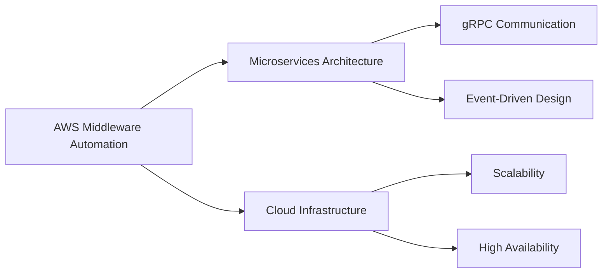

<div align="center">
  
</div>

<div align="center">
  
  [](https://git.io/typing-svg)
  
  
  [](https://linkedin.com/in/souravrajvi)
  [](https://souravportfoliov1.netlify.app/)
  [](mailto:souravrajvi@gmail.com)

</div>

---

## 🚀 About Me

```typescript
const sourav = {
    role: "Backend Developer",
    currentProject: "AWS Middleware Automation System",
    location: "India 🇮🇳",
    expertise: ["Microservices", "Distributed Systems", "Cloud Architecture"],
    
    techStack: {
        backend: ["Node.js", "Go", "Java", "Python"],
        frontend: ["React", "Next.js", "Vue.js", "Svelte"],
        databases: ["PostgreSQL", "MongoDB", "Redis", "Cassandra"],
        cloud: ["AWS", "GCP", "Heroku"],
        messaging: ["RabbitMQ", "gRPC", "WebSockets"],
        devOps: ["Docker", "Kubernetes", "Jenkins", "Nginx"],
        monitoring: ["Grafana", "Prometheus"]
    },
    
    askMeAbout: [
        "Node.js & Express",
        "gRPC & Microservices",
        "AWS Cloud Services",
        "PostgreSQL & MongoDB",
        "Redis Caching Strategies",
        "WebSocket Real-time Systems"
    ],
    
    currentFocus: "Building highly scalable distributed systems",
    funFact: "I debug with console.log and I'm not ashamed! 😄"
};
```

---

## 🛠️ Tech Stack

<details open>
<summary><b>🎯 Core Technologies</b></summary>
<br>

**Backend Development**
  


**Frontend Development**


**Databases & Caching**


**Cloud & DevOps**


**Tools & Technologies**


</details>

---

## 📊 GitHub Statistics

<div align="center">
  
  
</div>

<div align="center">
  
</div>

<div align="center">
  
</div>

---

## 🏆 GitHub Trophies

<div align="center">
  
</div>

---

## 💼 Current Focus



---

## 📫 Let's Connect!

<div align="center">
  
I'm always interested in connecting with fellow developers and discussing new technologies!

[](https://linkedin.com/in/souravrajvi)
[](https://souravportfoliov1.netlify.app/)
[](mailto:souravrajvi@gmail.com)

</div>

---

## 💡 Random Dev Quote

<div align="center">
  


</div>

---

<div align="center">
  
  
  ### Show some ❤️ by starring some repositories!
  
  
  
</div>
